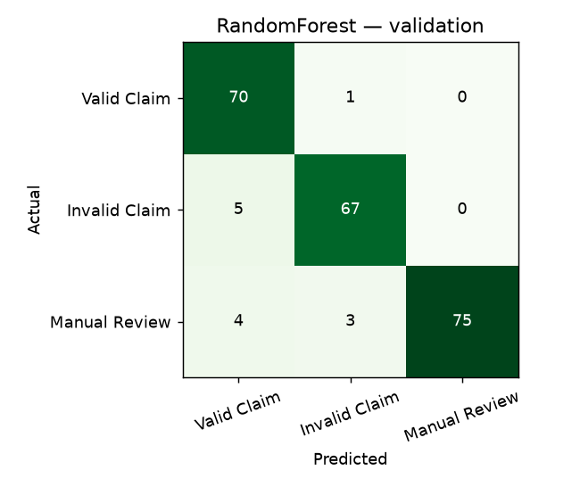
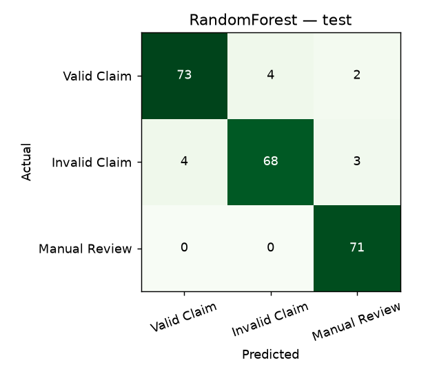
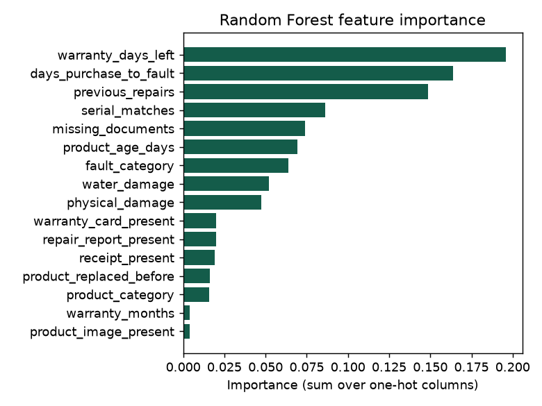

# Python model evaluation (model v2)

Generated by `python src/ml/scripts/train_model.py`. Never hand-edited.

## Procedure

1. 5-fold stratified cross-validation on the training split (1,050 claims).
2. Each algorithm fitted on train, scored on the validation split (225 claims).
3. The algorithm with the best validation accuracy is selected.
4. It is refitted on train + validation and scored once on the test split (225 claims).

Preprocessing: numeric features standardised, categorical features one-hot encoded (unknown values ignored), boolean features as 0/1. All of it is inside the saved pipeline, so prediction applies the same steps.

## Algorithms compared

| Algorithm | Hyperparameters | CV accuracy (mean ± sd) | Validation accuracy | Validation macro F1 |
|---|---|---|---|---|
| RandomForest **(selected)** | {'max_depth': 12, 'n_estimators': 150} | 94.76% ± 1.88% | 94.22% | 0.942 |
| GradientBoosting | {'learning_rate': 0.1, 'max_depth': 5, 'n_estimators': 120} | 94.38% ± 1.55% | 91.11% | 0.911 |
| LogisticRegression | {'max_iter': 1000} | 72.29% ± 1.74% | 64.44% | 0.645 |

Cross-validation folds: RandomForest: 0.943, 0.976, 0.962, 0.929, 0.929; GradientBoosting: 0.929, 0.957, 0.967, 0.938, 0.929; LogisticRegression: 0.695, 0.710, 0.738, 0.733, 0.738

## Validation results — RandomForest

```
               precision    recall  f1-score   support

  Valid Claim      0.886     0.986     0.933        71
Invalid Claim      0.944     0.931     0.937        72
Manual Review      1.000     0.915     0.955        82

     accuracy                          0.942       225
    macro avg      0.943     0.944     0.942       225
 weighted avg      0.946     0.942     0.943       225

```


## Test results — RandomForest refitted on train + validation

Accuracy **94.22%** (target: at least 85%).

```
               precision    recall  f1-score   support

  Valid Claim      0.948     0.924     0.936        79
Invalid Claim      0.944     0.907     0.925        75
Manual Review      0.934     1.000     0.966        71

     accuracy                          0.942       225
    macro avg      0.942     0.944     0.942       225
 weighted avg      0.942     0.942     0.942       225

```
Confusion matrix (rows = actual class):

|                      |   Valid Claim |   Invalid Claim |   Manual Review |
|:---------------------|--------------:|----------------:|----------------:|
| actual Valid Claim   |            73 |               4 |               2 |
| actual Invalid Claim |             4 |              68 |               3 |
| actual Manual Review |             0 |               0 |              71 |



## Feature importance

| Feature | Importance |
|---|---|
| warranty_days_left | 0.196 |
| days_purchase_to_fault | 0.164 |
| previous_repairs | 0.149 |
| serial_matches | 0.086 |
| missing_documents | 0.074 |
| product_age_days | 0.069 |
| fault_category | 0.064 |
| water_damage | 0.052 |
| physical_damage | 0.048 |
| warranty_card_present | 0.020 |
| repair_report_present | 0.020 |
| receipt_present | 0.019 |
| product_replaced_before | 0.016 |
| product_category | 0.016 |
| warranty_months | 0.004 |
| product_image_present | 0.004 |



## Sample test predictions

| claim_code   | actual        | predicted     |   Valid Claim |   Invalid Claim |   Manual Review |
|:-------------|:--------------|:--------------|--------------:|----------------:|----------------:|
| CLM-00738    | Invalid Claim | Invalid Claim |         0.042 |           0.942 |           0.016 |
| CLM-01180    | Manual Review | Manual Review |         0.158 |           0.05  |           0.792 |
| CLM-01117    | Manual Review | Manual Review |         0.052 |           0.037 |           0.911 |
| CLM-00265    | Valid Claim   | Valid Claim   |         0.693 |           0.109 |           0.198 |
| CLM-00116    | Valid Claim   | Valid Claim   |         0.746 |           0.119 |           0.135 |
| CLM-01451    | Manual Review | Manual Review |         0.102 |           0.013 |           0.885 |
| CLM-01128    | Invalid Claim | Manual Review |         0.06  |           0.014 |           0.926 |
| CLM-01145    | Manual Review | Manual Review |         0.13  |           0.068 |           0.802 |
| CLM-00630    | Invalid Claim | Invalid Claim |         0.036 |           0.954 |           0.01  |
| CLM-00444    | Valid Claim   | Valid Claim   |         0.87  |           0.047 |           0.083 |
